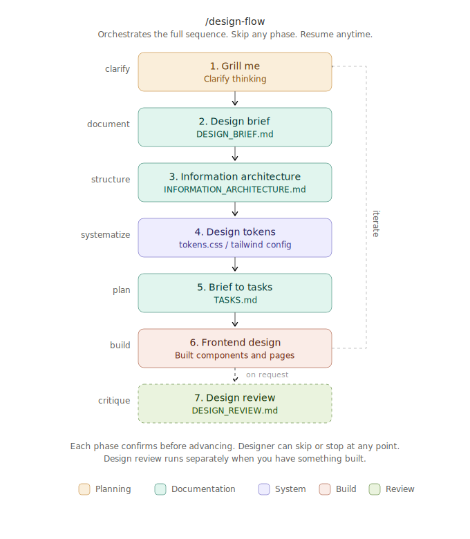

<p align="left">
  
</p>

<p align="left">
  <a href="https://github.com/julianoczkowski/skills"></a>
  <a href="https://github.com/julianoczkowski/skills"></a>
  <a href="#the-flow"></a>
  <a href="https://github.com/vercel-labs/skills"></a>
  <a href="#installation"></a>
  <a href="#installation"></a>
</p>

# Designer Skills for Claude Code & Cursor

A collection of agent skills for designers who prototype and build with AI coding tools. These skills encode design process so AI follows a structured path instead of producing random output.

<p align="left">
  <a href="https://youtu.be/1pV7bvbaCFg?si=JtVWoBHsb-hrguho" title="Watch on YouTube">
    
  </a>
</p>

<p align="left"><strong>WATCH:</strong> <a href="https://youtu.be/1pV7bvbaCFg?si=JtVWoBHsb-hrguho">https://youtu.be/1pV7bvbaCFg?si=JtVWoBHsb-hrguho</a></p>

## Installation

```bash
npx skills add julianoczkowski/designer-skills
```

The interactive CLI will walk you through which skills to install, which agents to target, and whether to install at project or global scope. Works with Claude Code, Cursor, Codex, Windsurf, and 40+ other agents.

## The Flow

The skills follow a deliberate sequence. You can use any skill individually, or run **`/design-flow`** to be guided through the entire sequence automatically.



0. **`/design-flow`** -- Run the full workflow as a guided sequence. Orchestrates all skills in order, lets you skip phases, confirms between each step. Start here if you want the complete process.
1. **`/grill-me`** -- Get interrogated about your plan until every design decision is resolved.
2. **`/design-brief`** -- Turn the grilling session into a structured design brief. Includes codebase exploration so the AI respects what already exists.
3. **`/information-architecture`** -- Define the structural skeleton: navigation, content hierarchy, page structure, URL patterns, user flows.
4. **`/design-tokens`** -- Generate a complete token system (colors, spacing, typography, motion) with light and dark mode palettes, based on the chosen aesthetic philosophy.
5. **`/brief-to-tasks`** -- Break the brief into an ordered checklist of independently buildable vertical slices.
6. **`/frontend-design`** -- Build with a named aesthetic philosophy. Mobile-first. Dark mode included. 8 design philosophies with concrete implementation parameters.
7. **`/design-review`** -- Run a structured critique against the brief. Supports code review and screenshot-based review. Runs on request, not automatically. Use after you have something built.

## Key Principles

### Respect Existing Code

Every skill that touches the codebase includes a detailed detection checklist: CSS variables, Tailwind config, UI framework themes, component directories, Storybook stories, token files, font loading, and package.json dependencies. This prevents the AI from generating a new button when one exists, or inventing a color that clashes with the established palette.

### Mobile-First

The `/frontend-design` skill mandates building mobile layout first (375px), then scaling up with `min-width` media queries. Touch targets, text sizing, and navigation patterns are all specified for mobile.

### Dark Mode by Default

The `/design-tokens` skill generates both light and dark palettes. The `/frontend-design` skill builds with CSS custom properties that support both `prefers-color-scheme` and manual toggle. The `/design-review` skill checks that dark mode is implemented correctly.

### You Don't Need to Name a Style

The aesthetic philosophies in `/frontend-design` are a menu, not a requirement. If you name one ("build this in a Dieter Rams style"), the AI follows those parameters. If you describe a vibe ("warm and clean"), it maps to the closest philosophy. If you say nothing, it picks one based on context and tells you which it chose.

### Your Work Persists

All design documents are saved to a `.design/` folder in your project, organized by feature. Running the flow for different features creates separate subfolders so nothing gets overwritten.

```
.design/
├── onboarding-flow/
│   ├── DESIGN_BRIEF.md
│   ├── INFORMATION_ARCHITECTURE.md
│   ├── TASKS.md
│   └── DESIGN_REVIEW.md
└── settings-page/
    ├── DESIGN_BRIEF.md
    └── TASKS.md
```

The folder name is derived from the feature being designed. Every skill in the flow reads from and writes to the same subfolder. If you return to a project later, the flow detects which features exist and where you left off.

## Aesthetic Philosophies (in `/frontend-design`)

The frontend-design skill includes concrete implementation parameters for 8 named design philosophies:

- **Dieter Rams** -- Less but better. Functional. No decoration without purpose.
- **Swiss / International Typographic** -- Grid-locked. Strong type hierarchy. Objective.
- **Japanese Minimalism (Ma)** -- Negative space is content. Quiet. Restrained.
- **Brutalist** -- Raw structure visible. Anti-polish. Content-first.
- **Scandinavian** -- Warmth plus restraint. Rounded. Accessible by default.
- **Art Deco** -- Geometric luxury. Bold symmetry. Statement typography.
- **Neo-Memphis** -- Playful chaos. Clashing color. Anti-corporate.
- **Editorial / Magazine** -- Content-led. Display typography. Print-inspired.

Each philosophy defines specific parameters for typography (font families, scale, spacing), color (palette approach, accent strategy), layout (grid type, composition rules), spacing (base unit, density), motion (duration, easing, what to animate), and detail treatment (borders, shadows, texture).

## Credits

- Design tree concept from _The Design of Design_ by Frederick P. Brooks Jr.
- Adapted for designers by [Julian Oczkowski](https://youtube.com/@aiforwork_app)
